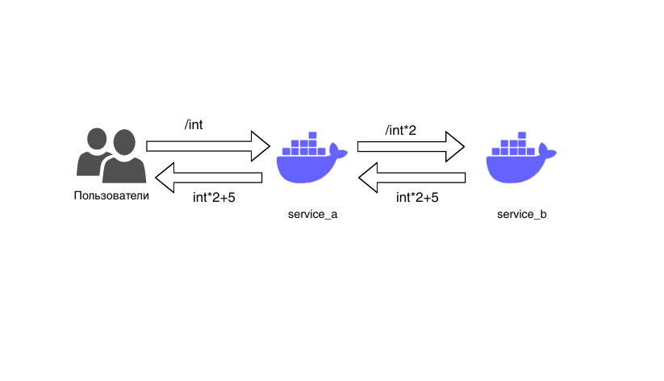

# Hexlet Logs Demo

## Пререквизиты

* docker-compose
* python3
* Учетка в [DataDog](https://datadoghq.eu)
* Базовое понимание, что такое логи (можно почитать гайд <https://guides.hexlet.io/logging/>)

## Архитектура приложения

## Как запустить и пользоваться

* Создаем файл `.env` с параметром `DD_API_KEY` (его можно получить из личного кабинета в DataDog)
* Собираем образы `docker-compose build`
* Запускаем наше демо-приложение `docker-compose up`
* Запускаем скрипт нагрузки `python3 tester.py` (может понадобиться поставить пакет requests)
* Логи начинают поступать в DataDog, там с ними можно поэкспериментировать
